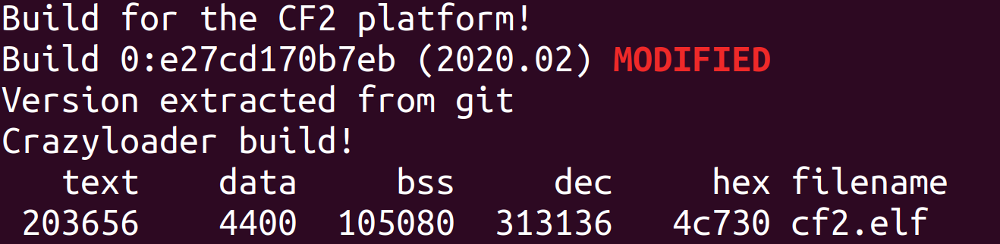

# Instructions for Applying Firmware Patches

The repository that these patches are applicable for is: 
https://github.com/bitcraze/crazyflie-firmware

However, it is easiest to locate the official realease versions of the firmware from here: 
https://github.com/bitcraze/crazyflie-release/releases

The complete instructions for applying the patch are given separately for each firmware version (currently only one firmware version).

## Install Compilation Toolchain

For compilation on Ubuntu 18.04, the toolchain is installed with the following commands: 
`sudo apt install gcc-arm-none-eabi` 

For compilation on Ubuntu 16.04, the toolchain is installed with the following commands: 
`sudo add-apt-repository ppa:team-gcc-arm-embedded/ppa` 
`sudo apt-get update` 
`sudo apt-get install libnewlib-arm-none-eabi` 

## Firware Version 2020-02

The hash of the exact commit to which this patch applies is: 
`e27cd170b7eb8be7ed1cbbc9f5622b469d335d97` 
As commited on Mon Feb 3 15:04:52 2020 +0100

To apply the patch, use the following sequence of commands:

**Step 1:** Clone the repository and checkout the appropriate commit: 
`git clone --recursive https://github.com/bitcraze/crazyflie-firmware.git` 
`cd crazyflie-firmware` 
`git checkout e27cd170b7eb8be7ed1cbbc9f5622b469d335d97` 
Note that it is also possible to checkout this commit using the commit tag, i.e., using `git checkout 2020.02`

**Step 2:** Apply the patch: 
`git apply <folder_to_dfall-system_repository>/crazyflie_firmware/crazyflie-firmware-version-2020-20/firmware_modifications_for_version_2020-20.patch` 

Now the repository is ready to compile. To do this, first make sure that you have
installed the necessary toolchain as described above ([Install Compilation Toolchain](#install-compilation-toolchain)).

**Step 3:** In the `crazyflie-firmware` folder where you applied the patch, compile the firmware using the following command: 
`make PLATFORM=cf2`

If everything is successful, you will see something like this: 

   

This should have created the binary file `cf2.bin`.

**Step 4:** upload the binary to the crazyflie processor by following the instructions given here: 
https://www.bitcraze.io/documentation/tutorials/getting-started-with-crazyflie-2-x/#update-fw 
Instructions are also given in the wiki of this repository under:
`/wiki/setup.md#firmware`

The pre-compiled binary files are already included in this repository. To update the firmware of just the main processor, select the file:
`<folder_to_dfall-system_repository>/crazyflie_firmware/crazyflie-firmware-version-2020-02/cf2-2020.02_withDfallPatch.bin` 

To update the firmware of both the main processor and the nrf processor, select the file: 
`<folder_to_dfall-system_repository>/crazyflie_firmware/crazyflie-firmware-version-2020-02/firmware-cf2-2020.02_withDfallPatch.zip` 