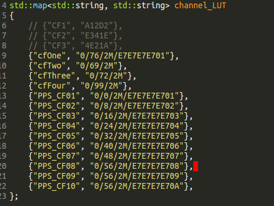

# Installation

On this page:
- [For student and teacher](#for-student-and-teacher)
- [Vicon Datastream SDK installation](#vicon-datastream-sdk-installation)
- [Additional steps for teacher](#additional-steps-for-teacher)
- [Steps for adding a Crazyflie to the system](#steps-for-adding-a-crazyflie-to-the-system)


## For Student and Teacher

### Install Script
Installation with the install script is the easiest. You will need only the install script from this repository, located in the ``install`` folder and named ``dfall_install_ros_<version>_ubuntu<version>.sh`` where you chose the version that matches your desired installation.


To run the installation, using terminal change directory to the folder containing ``dfall_install_ros_<version>_ubuntu<version>.sh`` and call it with
```
./dfall_install_ros_<version>_ubuntu<version>.sh <agent id>
```
The ``<agent id>`` needs to be a unique number that is used as identication for the agent's laptop. Make sure not that the script file is marked executable and do NOT run the script as root, i.e., do NOT run the script using ``sudo``. The installation script will ask for the password and only execute commands with root privilege when required.

### Manual Installation
The installation process consists of the following steps:

- **Installation of ROS:** The detailed instructions for the installation of ROS can be found [here](http://wiki.ros.org/kinetic/Installation/Ubuntu).

- **Clone this repository:** Clone this repository into the desired location on your computer, we use the location ``~/dfall``:
```
mkdir -p ~/dfall
```
```
cd ~/dfall
```
```
git clone https://gitlab.ethz.ch/dfall/dfall-system.git
```

- **USB Crazyradio and Python USB package:** To set up the crazyradio USB dongle just copy the rule files ``99-crazyflie.rules`` and ``99-crazyradio.rules`` from directory ``install`` to the directory ``/etc/udev/rules.d``:
```
sudo cp ~/dfall/dfall-system/install/99-crazyflie.rules /etc/udev/rules.d
```
```
sudo cp ~/dfall/dfall-system/install/99-crazyradio.rules /etc/udev/rules.d
```

- **Install the library ``pyusb``:**
```
sudo apt-get update
```
```
sudo apt-get install python-pip
```
```
sudo pip install pyusb
```
The second command installs the python package management system ``python-pip``. The third command installs the python USB package ``pyusb``

- **Environment Setup:** Add a new line in the ``/etc/hosts`` file that links the teacher's IP with the domain name ``dfallmaster``, create a file called ``/etc/dfall_default_agent_id`` that contains the agent id, and create a file called ``/etc/dfall_default_coord_id`` that contains the coordinator id.
```
sudo sh -c "echo '10.42.0.10 dfallmaster' >> /etc/hosts"
```
```
sudo sh -c "echo $1 >> /etc/dfall_default_agent_id"
```
```
sudo sh -c "echo 1 >> /etc/dfall_default_coord_id"
```


- **Build the D-FaLL ROS Package:** To do this you need to first change direction to the ``dfall_ws`` directory, where ``ws`` stands for workspace:
```
cd ~/dfall/dfall-system/dfall_ws
```
And then you build the D-FaLL ROS Package using the ``catkin_make`` command:
```
catkin_make -j4
```


- **Source scripts in ``.bashrc``:** Add following lines to the bottom of the file ``~/.bashrc`` (replace ``<catkin workspace>`` with correct directory)
```
source /opt/ros/kinetic/setup.bash
source <catkin workspace>/devel/setup.bash
source <catkin workspace>/src/dfall_pkg/launch/Config.sh
```

If you follow the steps above, then the ``<catkin workspace>`` should be ``~/dfall/dfall-system/dfall_ws``. Note that the workspace setup script will only appear after the first compilation of the catkin workspace.

If you are not sure at any point you can check out the ``dfall_install.sh`` script.


## Vicon Datastream SDK Installation

A Vicon motion capture system can be used to provide position and attitude measurements of the Crazyflie and close the feedback loop. The software provided by Vicon is propriety and hence is not included in this piece of Open Source software. In order to make the position and attitude data accessible over the network, the piece of software called the Datastream SDK needs to be downloaded and placed in the correct folder. Complete the following steps to achieve this:

- Download the Vicon Datastream SDK from [www.vicon.com/products/software/datastream-sdk](https://www.vicon.com/products/software/datastream-sdk) (or if this link is broken for some reason you can search for the Datastream SDK download directly via the Vicon website)
- This set of instructions was tested with version 1.7.1 of the Datastream SDK
- De-compress the downloaded file and open the folder that corresponds to the latest ``Linux64-boost-1.xx.x`` version, when tested this was ``1.58.0``
- From the files found in this folder, copy the file ``DataStreamClient.h`` into the following folder:
```
~/dfall_ws/src/dfall_pkg/include/
```
- Copy the file ``libViconDataStreamSDK_CPP.so`` into the following folder (noting that the folder ``lib`` and ``vicon`` may need to be created):
```
~/dfall_ws/src/dfall_pkg/lib/vicon/
```
- Copy all the files of the form ``libboost_*`` into the same ``/lib/vicon/`` folder
- Note that the ``DataStreamClient.h`` header file and the ``/lib/vicon/`` folder are in the ``.gitignore`` and hence will not be tracked or removed by the git repository (though some more advanced git commands may still remove them anyway).


## Additional Steps for Teacher

### Removing Config.sh and replacing
The ``Config.sh`` on the teacher's computer must be edited as follows. Comment out the lines of the form (i.e., add a # at the start of the line):
```
export ROS_MASTER_URI=...
```
And uncomment the line (i.e., remove the # at the start of the line):
```
export ROS_HOSTNAME=dfallmaster
```

### IP-Addresses
Currently the teacher's IP is ``10.42.0.10`` and the student's IP are of the format ``10.42.0.xx``, where xx is an unused address.

### Installation of cfclient
The steps to install the crazyflie client are taken from [here](https://github.com/bitcraze/crazyflie-clients-python). To install the cfclient you need to install its dependencies:
```
sudo apt-get install python3 python3-pip python3-pyqt5
```
clone the git repository, change the directory to the root directory of the repository and execute
```
pip3 install -e .
```

## Steps for adding a Crazyflie to the system

When we build a new crazyflie, it must be added to the system. The steps for
doing so are these:

1. Find out the radio address of the crazyflie that you want to fly
   (`radio://0/79/2M`, for example). You can change this address using the
   cfclient (Connect->Configure 2.0, write parameters and then reset the CF for
   changes to take effect) <br><br>
2. After having put some reflective markers in the crazyflie, register it in the Vicon system with the name that you want. (in the PPS case, we call them PPS_CFXX)<br><br>
3. Go to the file channelLUT.cpp (path:
   `dfall_ws/src/dfall_pkg/GUI_Qt/CrazyFlyGUI/src/channelLUT.cpp`) and add an
   entry with the name of the crazyflie and the radio address. Follow the
   formatting that the other entries have.

<p align="center">

</p>

4. Go to pps\_ws folder, and in a terminal write `catkin_make`<br><br>
5. Run the teacher's GUI, and if you registered correctly your crazyflie with the proper name in Vicon (and enabled it by ticking it in Vicon PC), in the crazyflies dropdown box, after pressing "refresh crazyflies" button you should be able to see the name you assigned.<br><br>
6. When you select it, you should see in the field "Radio address" in the radio address that you assigned to that name in channelLUT.cpp<br><br>
7. Link it to a CFZone previously created and to the student ID of your computer and, once everything is in the linked table,  click Save in DB<br><br>
8. Open the student's GUI in student computer, and you should be able to connect to your crazyflie, if every step above was done successfully.<br><br>
