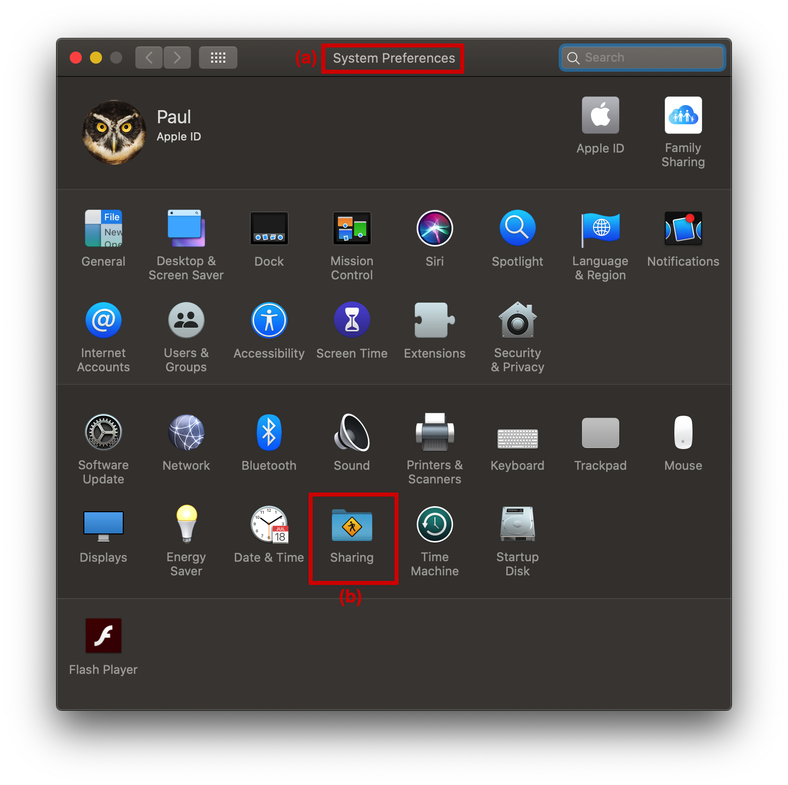
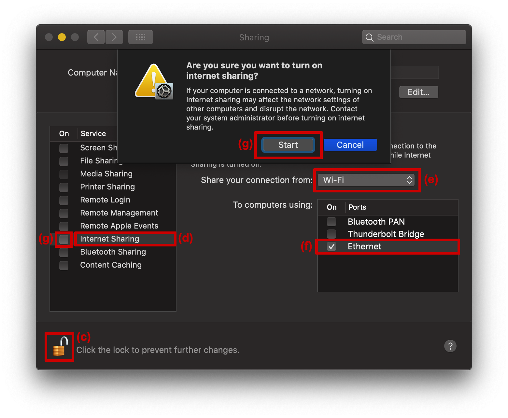
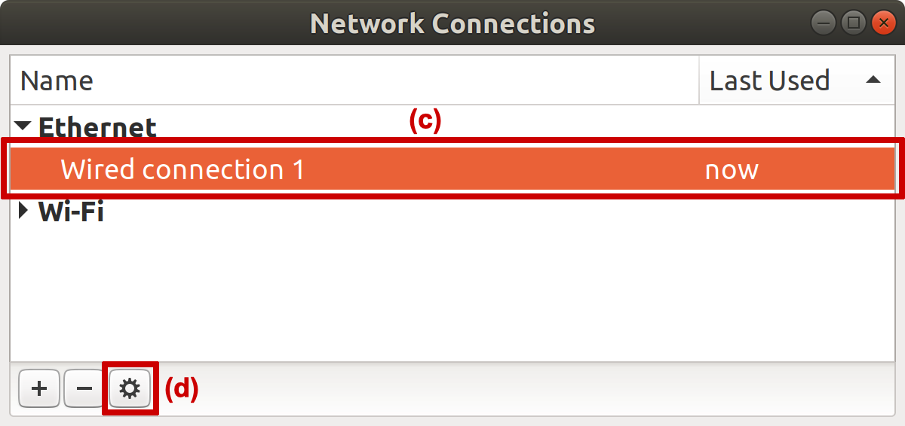
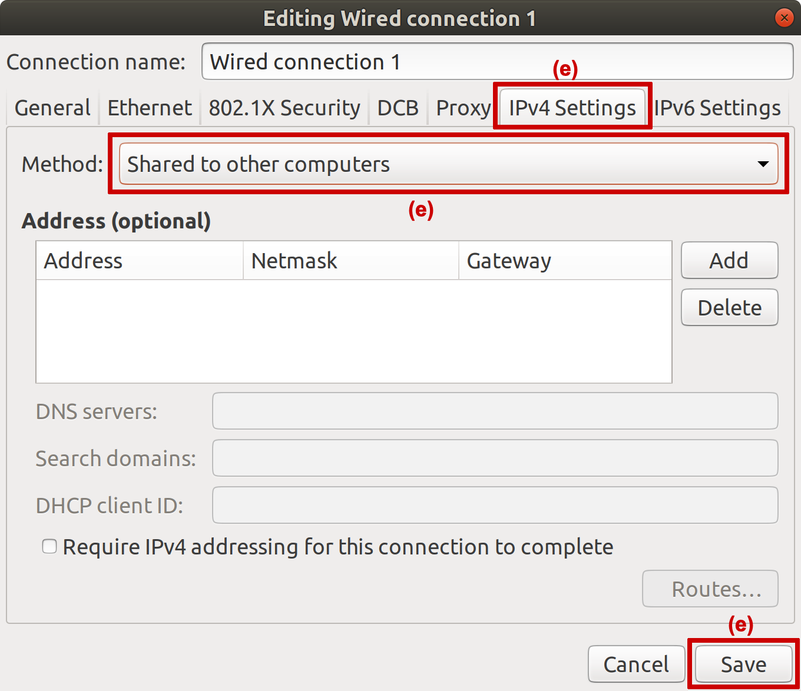
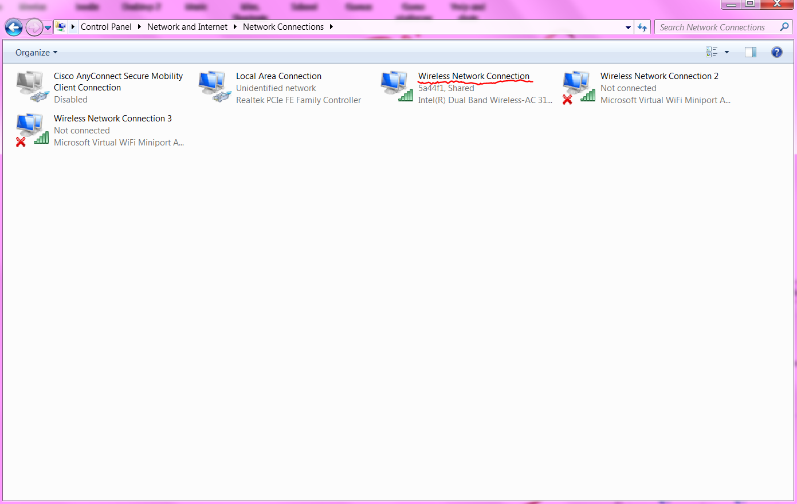
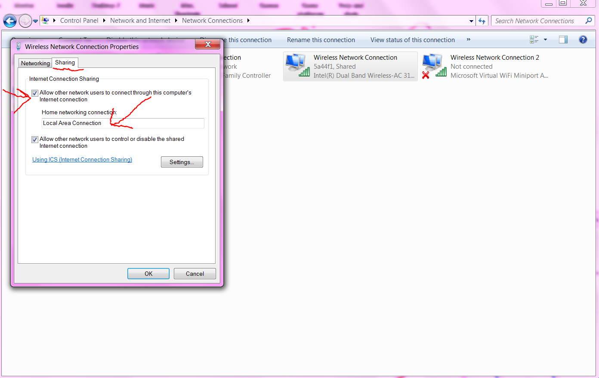
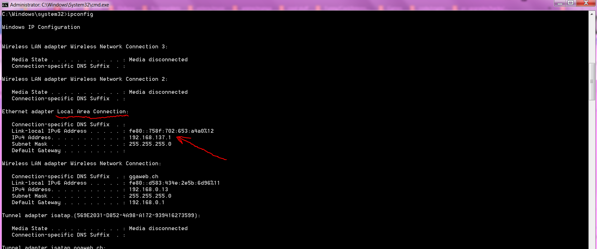
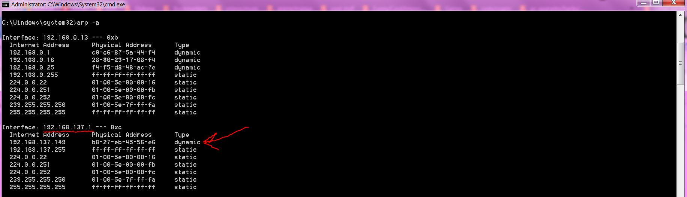

# Raspberry Pi Installation

On this page:
- [Finding the IP address of your RaspberryPi](#finding-the-ip-address-of-your-raspberry-pi)
- [Getting internet access on your RaspberryPi](#getting-internet-access-on-your-raspberry-pi)


## FINDING THE IP ADDRESS OF YOUR RASPBERRY PI

As mentioned in the wiki page [Network configuration of a RaspberryPi](network_configuration_of_raspberry_pi.md), if your RaspberryPi is configured to receive a dynamically allocated IP address from the host to which it is connected, then discovering the IP address of the RaspberryPi can be quite a battle.


### Login to the router and look up the list of all connected devices

It is difficult to provide generic instructions for this, but the steps should be something like the following:

**(a)** Locate the sticker on the back of your router which provides the various default settings.
<br>
**(b)** On a computer connected to your router's network, open an internet browser window and visit the IP address indicated on the back of the router. This should bring up a login screen for the router.
<br>
**(c)** Login to the router using the password indicated on the back of the router.
<br>
**(d)** Navigate the settings of the router to display the IP addresses of all connected devices. If the location of this list is not obvious from the menu items, try poking around in something like the "network" or DHCP settings.
<br>
**(e)** The IP address of the RaspberryPi will be one of those listed. If displayed, the "Device Name" of the RaspberryPi will be "ubuntu".

If it is not possible to follow these steps, then try googling instructions for the brand and model of your router.


### Ping the broadcast address of the network

Another way to find the IP addresses of connected devices is to ping the broadcast address of the network. This method will only show the IP address of those connected devices that are configured to respond to a broadcast ping, and thus the RaspberryPi is configured to repond to such broadcast ping (see wiki page [Installation of Ubuntu of RaspberryPi](installation_of_ubuntu_on_raspberry_pi.md)).

The easiest way to find the IP address of the network is to look at the IP configuration of your own computer. The following steps are one amongst many ways to do this:

**(a)** On a computer connected to your router's network, open an terminal window (on Mac or Linux) or a command prompt (on Windows)
<br>
**(b)** Show the IP configuration of your computer using the command ``ifconfig`` (on Mac or Linux) or ``ipconfig`` (on Windows)
<br>
**(c)** In the output look for the entry corresponding to the network connection of interest (WiFi or ethernet) and find the line that provides the broadcast address. This might look something like the following:
```
inet 192.168.0.123 netmask 0xffffff00 broadcast 192.168.0.255
```
**(d)** Hence the broadcast address for this example is ``192.168.0.255``
<br>
**(e)** Still in the terminal or command prompt window, ping the broadcast address with one of the following commands:

- On Mac OS X: ``ping 192.168.0.255``
- On Ubuntu 18.04: ``ping -b 192.168.0.255``
- On Windows: ``ping 192.168.0.255``

**(f)** The IP address of the RaspberryPi should be one of the IP addresses from which a response is received. As an example, the output of the ping should look something like the following:
```
PING 192.168.0.255 (192.168.0.255): 56 data bytes
64 bytes from 192.168.0.123: icmp_seq=0 ttl=64 time=0.121 ms
64 bytes from 192.168.0.101: icmp_seq=0 ttl=64 time=116.900 ms
64 bytes from 192.168.0.77: icmp_seq=0 ttl=64 time=525.345 ms
```

**(g)** To figure out which address corresponds to the RaspberryPi, open an internet browser window and visit each address separately until you get the web interface hosted by the RaspberryPi. For the example ping output above, the IP address of the RaspberryPi is either ``192.168.0.123``, ``192.168.0.101``, or ``192.168.0.77``.


## GETTING INTERNET ACCESS ON YOUR RASPBERRY PI

It is useful for the RaspberryPi to have internet access so that you can ``git pull`` the latest version of the ``dfall-system`` repository via the web interface. The information below describes how to give internet access to the RaspberryPi for a few possible network configurations.


### When the RaspberryPi is plugged directly into your home router

By default, most home router will provide internet access to any device that is plugged directly into one of the router's ethernet ports. If that is the case, then this option is by far the easiest, simply plug into your RaspberryPi and you are good to go. Though if the RaspberryPi is configured to receive a dynamically allocated IP address, then you need to follow the hints above to find its IP address.

If you home router does NOT provide internet access to a device that is plugged directly into one of the router's ethernet ports, then you are on your own. But this is fine, because you or someone in your household likely chose this setting, and that person should know how to adjust the setting to allow the RaspberryPi to access the internet. Failing that, ask google about changing the configuration of your router, or press and hold the reset button that is usually hidden on the back of the router.


### When the RaspberryPi is plugged directly into your computer

Most modern computers and their operating systems (Windows, Mac OS, or a Linux distribution) allow for connecting to the internet over WiFi and then passing on this internet connection to a device connected to the ethernet port of the computer. There are three generic steps to follow for achieving this:

**Step 1.** Enable the "internet sharing over ethernet" option in the settings of your computer
<br>
**Step 2.** Plug the RaspberryPi into the ethernet port of your computer
<br>
**Step 3.** Find the IP address of the RaspberryPi

The following provides additional details for each step.

#### Step 1 for Mac OS X -  enable "internet sharing over ethernet"

**(a)** Open the "System Preferences" application
<br>
**(b)** Go to "Sharing"
<br>
**(c)** If necessary, "Click the lock to make changes"
<br>
**(d)** Select the "Internet Sharing" row in the box on the left hand side so that the status and options for "Internet Sharing" are visible on the right hand side
<br>
**(e)** Using the drop down box labelled "Share connections from:" select the option "Wi-Fi"
<br>
**(f)** Using the options labelled "To computers using:" turn on the "Ethernet" port
<br>
**(g)** Turn "Internet Sharing" on using the box on the left hand side, and accept to "Start" this service

<p align="center">

</p>

<p align="center">

</p>


#### Step 1 for Ubuntu 18.04 -  enable "sharing to other computers"

**(a)** Open a terminal window
<br>
**(b)** Launch the network connection editor by entering the following command:
```
nm-connection-editor
```
> Note: the options accessible via the network connection editor are slightly more than those accessible via the "Network" section of the "Settings" app, and that difference is critical for this step.

**(c)** Select the "Ethernet" connection that corresponds to the port that you plugged the Raspberry Pi into.
<br>
**(d)** Click the settings cog wheel.
<br>
**(e)** In the window that appears, select the "IPv4 Settings" tab and use the drop down box labelled "Method:" to select the option "Shared to other computers", and "Save" the changes

<p align="center">

</p>

<p align="center">

</p>


#### Step 1 for Windows -  enable "internet sharing over ethernet"
This was only tested on Windows 7 and Windows 10. Pictures are included from Windows 7 below. The instructions should presumably be similar for other versions. If not, a google search should hopefully provide necessary details.

**(a)** Windows 7: Open Network Connections (easiest way is to right click on the internet symbol in the taskbar -> Network and Sharing Center -> Click Change Adapter Settings in the left menu).
Windows 10: "Network and internet settings" and "Change adapter options" instead of "Network and sharing center" and "change adapter settings" as in Windows.
<br>
**(b)** Windows 7: Right click on the wifi adapter and then click properties -> Sharing tab -> Check both boxes and pick the Ethernet Adapter in the drop-down menu.
Windows 10: There isn't a drop down, which adapter to share to is handled automatically (this could be because there was only one other adapter).

<p align="center">

</p>

<p align="center">

</p>

#### Step 2 - plug the RaspberryPi into the ethernet port of your computer

Although seemingly straight forward, if you run into problem in step 3, it can help to return here to step 2 and do a "restart":

**(a)** Unplug the ethernet cable from the Raspberry Pi
<br>
**(b)** Shut down the RaspberryPi (by removing its power source)
<br>
**(c)** Wait 10 seconds
<br>
**(d)** Plug the ethernet cable back into the Raspberry Pi
<br>
**(e)** Boot up the Raspberry Pi
<br>
**(f)** Wait 1-2 minutes for the boot up to complete
<br>
**(g)** Move on to step 3 below


#### Step 3 for Mac OS X - Find the IP address of the RaspberryPi

The easiest way to find the IP address of the RaspberryPi is to ping the broadcast address of the network ([as described above](#ping-the-broadcast-address-of-the-network)) that is created for sharing internet over the ethernet port of your computer. So all you need to figure out is the broadcast address. Open terminal and type the command:
```
ifconfig
```
and in the output look for the entry ``bridge100``, for which the first few lines should look something like the following:
```
bridge100: flags=8a63<UP,BROADCAST,SMART,RUNNING,ALLMULTI,SIMPLEX,MULTICAST> mtu 1500
	options=3<RXCSUM,TXCSUM>
	ether ae:57:ad:c4:d7:23
	inet 192.168.2.1 netmask 0xffffff00 broadcast 192.168.2.255
```
Hence ping the broadcast address with the following command:
```
ping 192.168.2.255
```
The IP address of the RaspberryPi should be one of the IP addresses from which a response is received.


#### Step 3 for Ubuntu 18.04 - Find the IP address of the RaspberryPi

The easiest way to find the IP address of the RaspberryPi is to ping the broadcast address of the network ([as described above](#ping-the-broadcast-address-of-the-network)) that is created for sharing internet over the ethernet port of your computer. So all you need to figure out is the broadcast address. Open terminal and type the command:
```
ifconfig
```
and in the output look for the entry corresponding to the ethernet port, likely to be the only entry starting with ``enx``, for which the first two lines should look something like the following:
```
enx204747fb2716: flags=4163<UP,BROADCAST,RUNNING,MULTICAST>  mtu 1500
        inet 10.42.0.1  netmask 255.255.255.0  broadcast 10.42.0.255
```
Hence ping the broadcast address with the following command:
```
ping -b 10.42.0.255
```
The IP address of the RaspberryPi should be one of the IP addresses from which a response is received.


#### Step 3 for Windows - Find the IP address of the RaspberryPi

This was only tested on Windows 7 and Windows 10. Pictures are included from Windows 7 below. The instructions should presumably be similar for other versions. If not, a google search should hopefully provide necessary details.

**(a)** Connect the Ethernet cable directly between the Raspberry Pi and the computer -> open cmd (windows button -> 'cmd' -> enter)
<br>
**(b)** Run ```ipconfig``` and remember the ip address of the Ethernet adapter
<br>
**(c)** Run ```arp -a``` and look at the results for the ip corresponding to the Ethernet adapter. The Raspberry Pi should be the first ip in these results. On Windows 7 it is likely to be an ip with dynamic type. (If there are multiple, try them in your browser until you find the right one).

<p align="center">

</p>

<p align="center">

</p>
