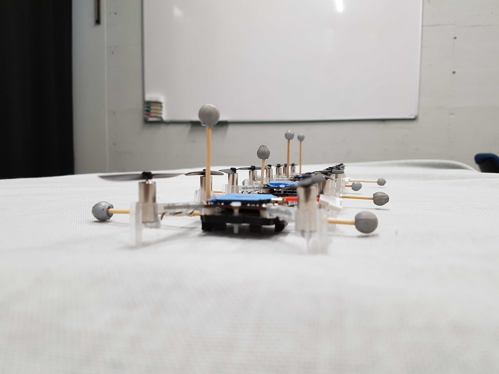
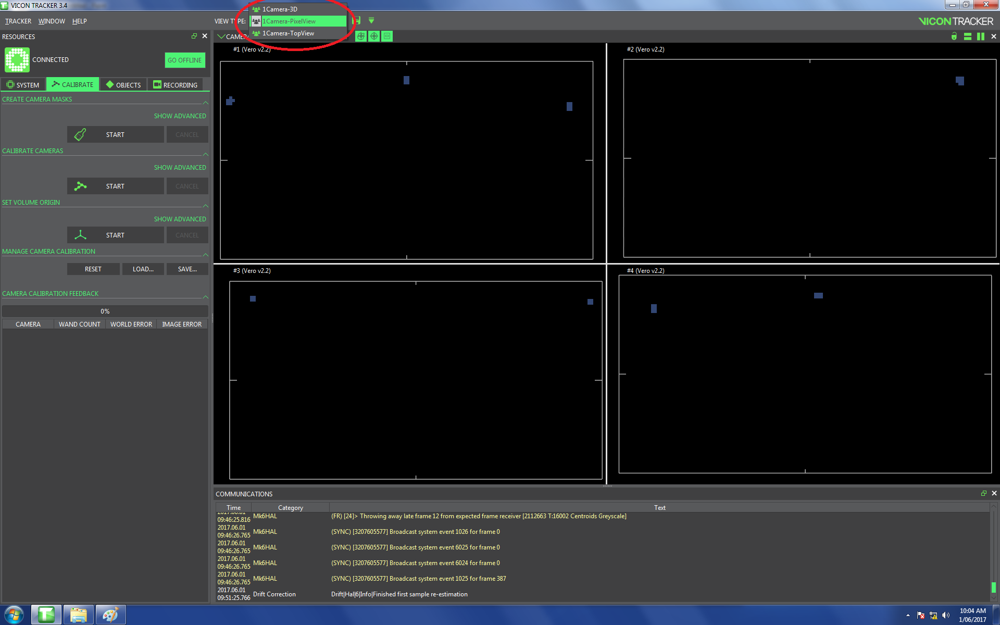
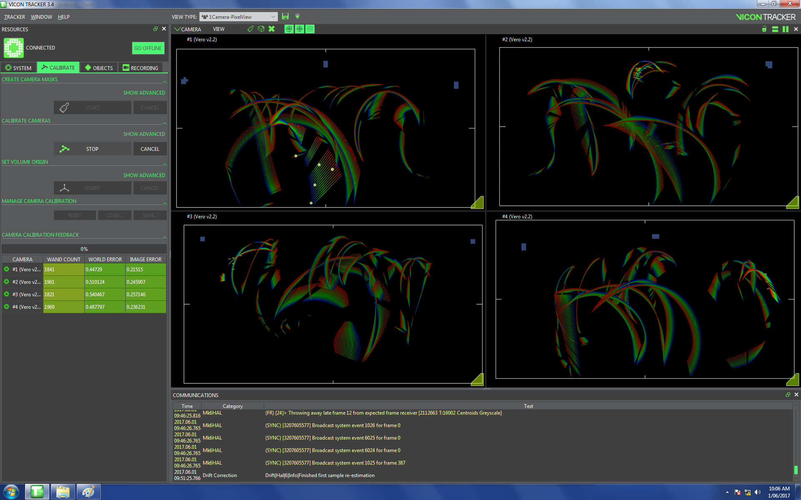
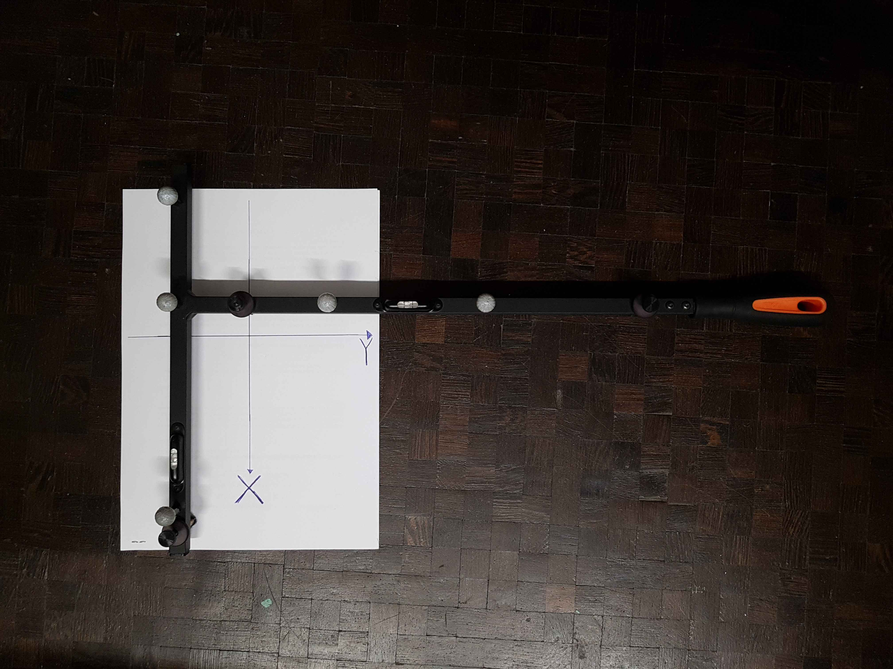
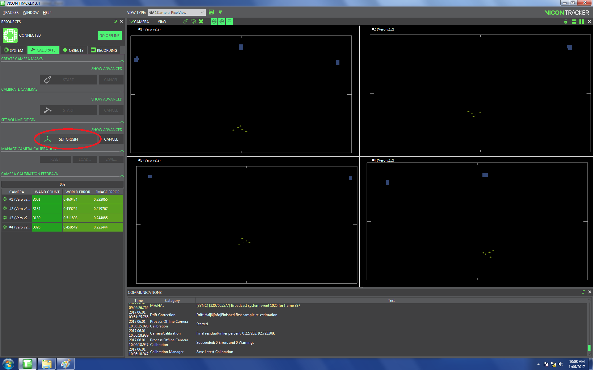
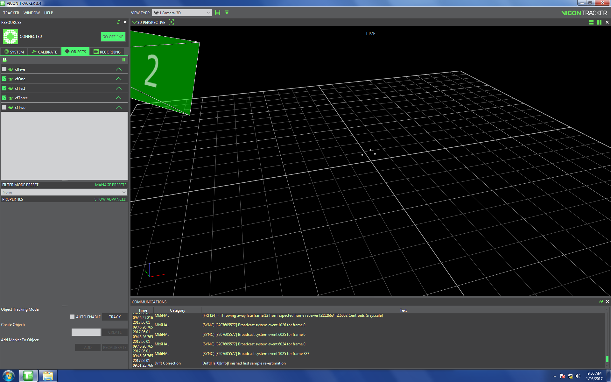
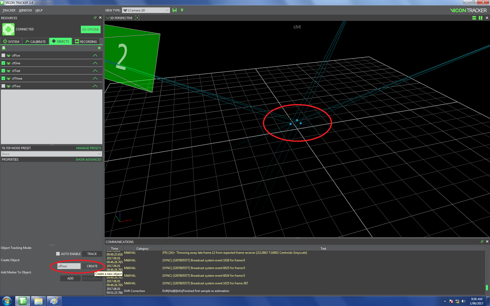
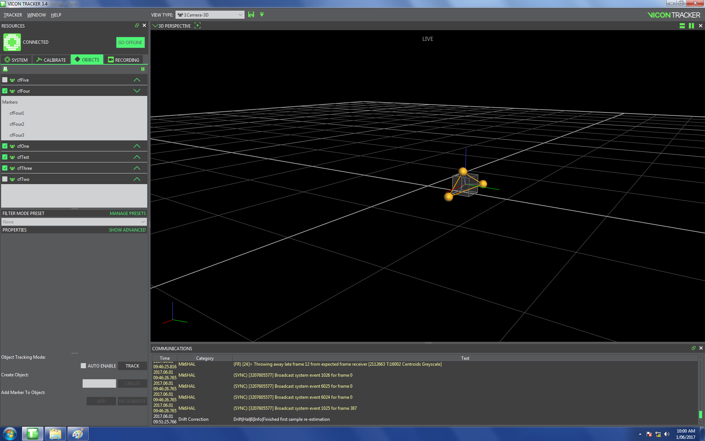

# Vicon
## What is Vicon
Vicon is the tracking system for this project. The four cameras in each corner of the room can track the gray markers. One can define objects in the ViconTracker software. Those are then visible in the software or their location data can be shared over a network with others.

## Our Vicon Setup

For the D-FaLL space we have a separate computer that runs the Vicon Tracker software. Using that software we define the Crazyflie objects that utilise three markers in differing configurations so as to be distinguishable from one another, see picture.

The Vicon Tracker software sends motion capture localisation data over the network to the `ViconDataPublisher` node, and this node then publishes the data onto the ROS network. We typically run the `ViconDataPublisher` node on a separate computer used by the teacher, and each student recieves the data on their computer via the ROS network.

## Instructions
### Calibrating Vicon

1. For calibrating Vicon go to *CALIBRATE* where you should choose *Camera-PixelView* as the *view type*.

  

2. Click on *START* in the *Calibrate Cameras* section. Now you have to walk around the room with the L-wand and swing it in every direction. You can stop when the program is finished.

  

3. Then you have to lay the wand down somewhere in the room, where you want the origin of the coordinate system to be. How the wand defines the x- and y-axis is shown below. (The handle defines the y-axis, where positive is in direction of orange part. The x-axis is positive in the direction of the longer arm)

   

4. Click on *START* under the set volume origin section. This cause the button label to change to *SET ORIGIN*, click on this and you're done.

### Defining a CrazyFlie in ViconTracker

1. Go to *OBJECTS* and choose *Camera-3D* as the *view type*. There you should see some markers.

2. Make sure that the Crazyflie antenna is facing in the positive x-axis when you define the Crazyflie, because the controller relies on this configuration.

3. Define an object by holding `ctrl` while you click on the markers that are to define the Crazyflie. Then type the name of this object in the box circled in the lower left corner. Finish by clicking *CREATE* and saving with `ctrl-s`. The Vicon Tracker software does not share the object's data if until you have saved the addition of this new object.

     

4. After successfully defining the object, it should look like this:

