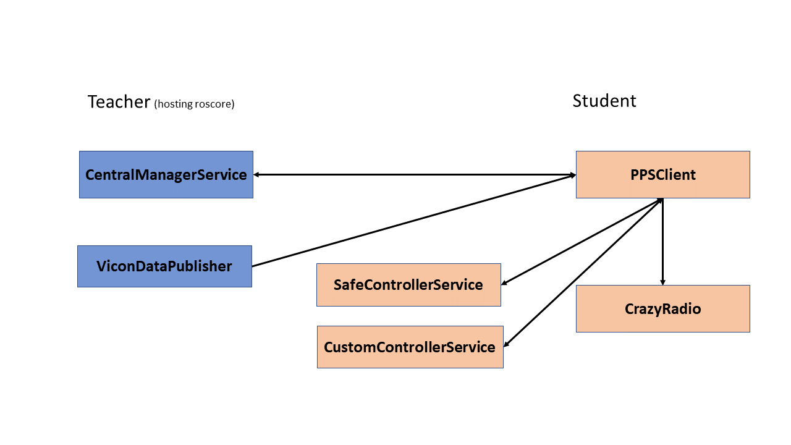

# ROS structure

## Teacher Nodes
The following are the ros nodes that run on the teacher's computer. They are located in the root namespace.

### ViconDataPublisher

#### Description
The ``ViconDataPublisher`` node takes all the data from Vicon and publishes it to the whole ROS network. Its message contains all the unlabeled markers for display in the GUI and all the crazyflies. If a crazyflie is occluded a flag is set and a message will be sent anyway.

#### Configuration
In file ``ViconConfig.yaml``:
- ``hostName``: the address and port of the Vicon computer

### CentralManagerService

#### Description
The ``CentralManagerService`` manages the crazyflie database. The database consists of crazyflie contexts which contain the name of the object in Vicon, the crazyradio address and the allowed area for the crazyflie to flie in.

It exposes four services to edit the content of the database: ``CMCommand``, ``CMRead``, ``CMUpdate`` and ``CMQuery``. ``CMCommand`` defines a command to tell the ``CentralManagerService`` to save or to reload the ``Crazyflie.db``. ``CMRead`` is used to read the full contents of the database and ``CMUpdate`` to edit or insert single records. ``CMQuery`` is used by the ``PPSClient`` on the student's laptop to query the assigned crazyflie context.

#### Configuration
In file ``Crazyflie.db``:  
Defines all the crazyflie contexts in a ``.csv`` format. The csv parser is not very stable and therefore unnecessary whitespaces or formatting other than empty lines should be avoided.

## Student Nodes
The following are the ros nodes that run on the student's computer. They are located in the namespace given by their student id.

### PPSClient

#### Description
The ``PPSClient`` manages the student's nodes. Upon startup it queries the ``CentralManagerService`` for the crazyflie context and connects with the safe and the custom controller.

Everytime a new Vicon message is published the ``PPSClient`` will transform the data to the local coordinate system and call the currently used controller service, which can be the safe or the custom controller. The local coordinate system is the center of the allowed area. If the custom controller is running, it will do a safety check, which, if it fails, causes the ``PPSClient`` to switch to the safe controller. The control commands are then sent to the ``CrazyRadio``.

The ``PPSClient`` subscribes to a local topic with which a certain controller can be loaded or the crazyflie disables and enabled. There are the scripts ``enable_crazyflie``, ``disable_crazyflie``, ``load_custom_controller`` and ``load_safe_controller`` in the ``scripts`` directory, which can be called for ease of use.

#### Configuration
In file ``ClientConfig.yaml``:
- ``safeController``: the relative ros path to the safe controller
- ``customController``: the relative ros path to the custom controller
- ``strictSafety``: turns angle safety check on and off
- ``angleMargin``: defines maximal allowed angle when strict safety is on, 1 means 90 degrees

### CrazyRadio

#### Description
The ``CrazyRadio`` node subscribes to the control command topic of the ``PPSClient`` and sends them over the crazy radio to the crazyflie. When the node is stopped, a command to turn off the motors will be sent to the crazyflie. This will not happen if the node crashes or the process is killed.

#### Configuration
There is no configuration available for this node.

### SafeControllerService

#### Description
The ``SafeControllerService`` is a working controller that is used when the custom controller fails. The implementation uses an LQR controller with a Kalman filter.

The controller subscribes to a local topic over which the setpoint can be changed. There is a script in the ``scripts`` directory called ``safe_controller_setpoint`` which takes parameters for the x, y, z and yaw values of the setpoint.

#### Configuration
In file ``ClientConfig.yaml``:
- ``feedforwardMotor``: the equlibrium feedthrough value for the controller
- ``motorPoly``: the coefficients used for the motor equation that transforms the force to the motor output

- ``gainMatrixRoll``: the row for the gain value of the gain matrix
- ``gainMatrixPitch``: the row for the pitch value of the gain matrix
- ``gainMatrixYaw``: the row for the yaw value of the gain matrix
- ``gainMatrixThrust``: the row for the thrust value of the gain matrix

- ``filterGain``: the feedback gain
- ``estimatorMatrix``: the matrix used for the Kalman filter

- ``defaultSetpoint``: the first setpoint used
