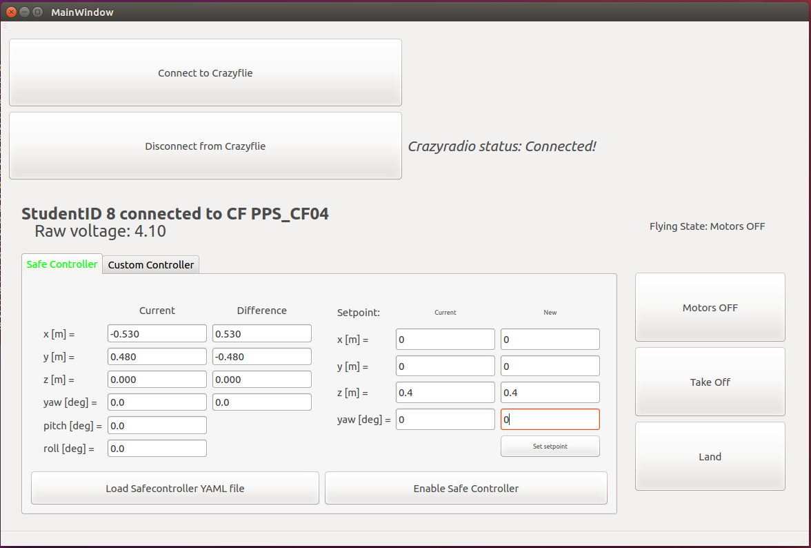
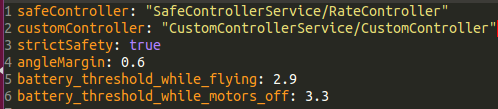
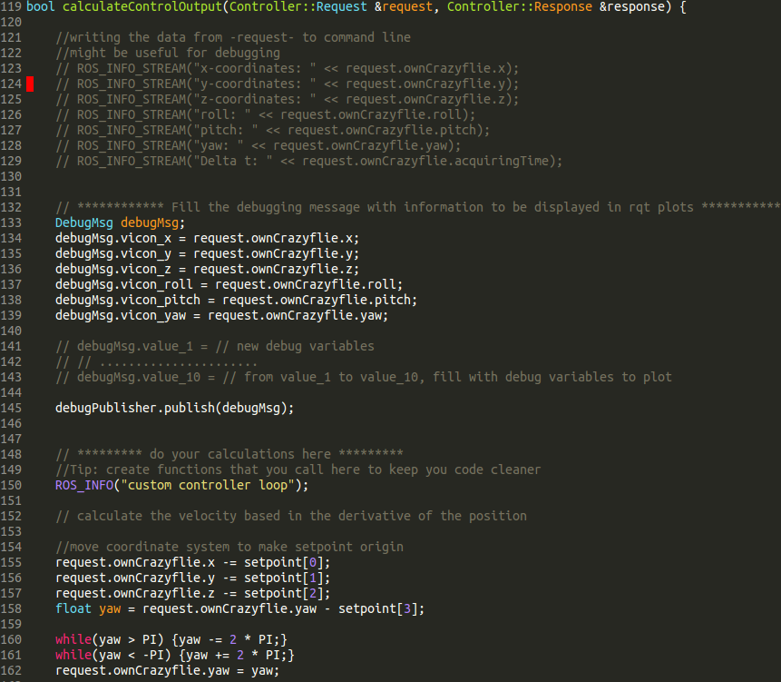
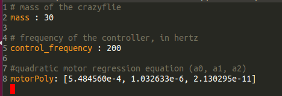
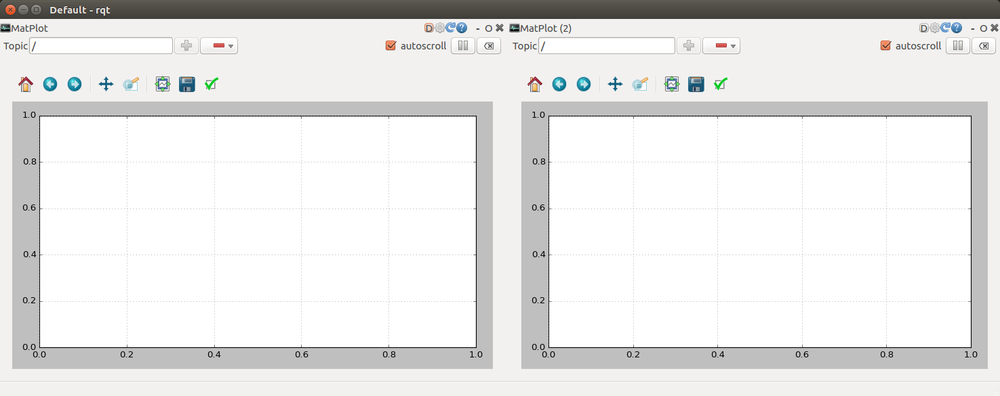

# Workflow for students.

### Hardware prerequisites:
* Make sure you are connected to the network (cable inserted and check if connected to Vicon in the settings).
* Insert a CrazyRadio into one of your USB-ports on your Laptop.
* Start your crazyflie. To know which one is the one you have been linked to,
ask your teacher. The Crazyflie must be started on a flat surface, as the
gyrosensor needs to initialize.

### Software prerequisites:
  * In the software side, everything has already been set up for the course, but
    it would be helpful to check if the repository is in the last version, and
    if the source code has been properly compiled. To do this, follow the next steps:
       1. Go to the next folder: `cd ~/work/D-FaLL-System/dfall_ws`
       2. Checkout master branch of the repository and pull: 
         ``git checkout master`` 
         ``git pull origin master`` 
       3. Compile the source code running `catkin_make`

---

### Start the student's GUI

  * Once all the prerequisites have been fulfilled, you can start the student's GUI by going to a terminal and typing:
    `roslaunch dfall_pkg agent.launch`

    *Note: for this to work, the teacher's computer has to be connected to the network and the `master.launch` GUI has to be started before. Please wait until your teacher has already set up everything.*

  * Once started, you will see something like this: 

  * Connect to/Disconnect from Crazyflie: this connects/disconnects your computer to the assigned Crazyflie using the Crazyradio USB dongle. 
    * Crazyradio status: can take the values "Connected!", "Disconnected" or
      "Connecting...", and the icon changes to display the current status. 
    * The title at the top contains information about your AgentID number, and the Crazyflie that is allocated to you. This is the only Crazyflie you can connect to.  

  * The voltage displays the instantaneous voltage of the battery of the Crazyflie, in Volts. 
    * The battery icon displays this relative to the voltages for full and empty. 
    * Because flying requires a high current draw from the battery, the full and empty voltages levels automatically adjust depending on whether your Crazyflie is flying or has the motors turned off. 
    * If the battery voltage falls below the empty level, then a low battery warning is raise and your Crazyflie will be forced to land. 
    * You must change the battery if the low battery warning occurs because continuing to drain the battery further will cause permanent damage to the battery.  

  * There are 3 buttons to control the flying state of your Crazyflie: **"Take-off", "Land", and "Motors-OFF"** 
    * The icon displays the current flying state. **It is important to know that you can only "Take-off" when the state is "Motors
  OFF", and you can only "Land" if the state is NOT "Motors OFF".** 
    * **IMPORTANT: YOU CAN PRESS SPACE-BAR AT ANYTIME AS A SHORT-CUT TO THE "MOTORS-OFF" BUTTON.**  

  * In the lower part of the GUI there are two tabs: **"Default" and "Student" controller** 
    * These tabs allow you to interact with the respective controller. 
    * In these tabs, the first column of numbers provides information about the current position of the Crazyflie, the second column of numbers is computed as the difference between the current position and the current setpoint, and the third column of number is the current setpoint. This information is useful for keeping track of the error of your controller. 
    * The next column of boxes can be edited and allows you to type in a new setpoint. When you press the button "Set
  setpoint" (or the enter key on the keyboard), we change the current setpoint with the information filled.  

  * The button called "Enable <controller> Controller" enables the selected controller. The current enabled controller is the one which is highlighted in green in the tab name. 
    * The button "Load <filename> YAML file" loads and refreshes the parameters that are in the corresponding YAML file.  

  * You can now play with the landing, take off and change of setpoint using the default controller to get familiar with the system. 

  *Note: there are different parameters in the file called `DefaultController.yaml`, in the folder param (use `roscd dfall_pkg/param` in a terminal to go there).* **These are the paramteres of the default controller parameters and should NOT be changed.** *Take a look at the file and get familiar with the format used, since may have to write your own for the student controller.*

### Creating your own controller!
In this part, we will learn how to design our own controller and actually
deploy it and see it working in our Crazyflie. For this, there are a set of
important files that should be taken into account.

#### Files of interest:

* In `dfall_pkg/src`

  * _StudentControllerService.cpp_  
  The file where students can implement their own controller. It provides already the ros service with the System Config. It can be used as a template.

* In `dfall_pkg/param`

  * _ClientConfig.yaml_

  This file needs to be changed to define names for the student controller. **The safeController property should not be changed!**  

      *Usage:*

      *`studentController: "SERVICENAME/TOPICNAME"`*

      *where SERVICENAME is the name of the cpp-file that contains the student controller (e.g. the provided template StudentControllerService) and
      where TOPICNAME is the defined name for the topic which is defined insided
      the controller's code.*

      *`strictSafety: <bool>`*

      *By setting _strictSafety_ to true you limit
      your student controller from assuming certain angles before the safe controller
      takes over. Set it to false and the safe controller only takes over when the
      crazyflie flies out of its defined range.*

      *`angleMargin: <float>`*

      *This value can be used to change the acceptable angles for pitch
      and roll. angleMargin=1 means that your crazyflie could flip 90°. The safe
      controller might not recover from such angles. Therefore you should use values
      in the range of 0.4 to 0.7.*

      *`battery_threshold_while....`*

      *Sets the low battery thresholds at which the crazyflie will automatically
      land. **Do not change these values.***

* In `dfall_pkg/`

  * CMakeLists.txt

      *This file defines all important things that are needed for build process.
      You need this file, if you for example choose to add a new controller with a new name. You then need to add several lines in this file.
      The easiest way is to search for a file that exists and just add all the
      same things for your new file.*

<!-- ##### -- Files to look at: -->
<!-- in `dfall_ws/src/dfall_pkg/param` -->
<!-- * _SafeController.yaml_   -->
<!-- This file contains the control parameters that the SafeControllerService uses. The SafeControllerService loads this file when it starts. You might want to use a similar approach and can try to copy some functionality from  SafeControllerService.cpp. -->

<!-- in `dfall_ws/scr/dfall_pkg/launch`   -->
<!-- The launch files contained in this directory are used to launch several nodes and some parameter files to be launched simultaneously. It is best, that you take a look at them yourself, but here is a brief explanation what the different launch files are for.  -->
<!-- To start the whole thing type the following in a terminal whilst being in the launch directory.  -->
<!-- `roslaunch filename.launch` -->

<!--   * _Master.launch_  -->
<!--   This doesn't concern the students, nor will it work. This launches the GUI for the teacher and the services he needs. -->
<!--   * _Student.launch_  -->
<!--   This launches the nodes for the CrazyRadio, the PPSClient, SafeController and CustomController. Make sure that __ClientConfig__ is correctly set up. -->
<!--      -->
<!--   * _StudentCirlce.launch_ : as an example  -->
<!--   This launches CircleControllerService instead of the normal CustomControllerService. Therefore the ClientConfig has to be adjusted. This should show a way of how to work with the CustomControllerService. -->
<!--   * _StudentFollow.launch_ : as an example  -->
<!--   As the circle launcher, this starts another service that enables one crazyflie to _copy_ the behavior of another crazyflie. For this to work, two student groups have to collaborate because some things have to manipulated manually in the cpp files of the Circle and Follow code. -->

#### Steps to create a student controller
1. Open the file `StudentControllerService.cpp` and go through it. You should see
   that the file is already filled with some code. This code is a simple LQR
   controller that is offered as a template for the student to start developing
   their own controller. Change the file as you wish with your own controller
   algorithm. The function partially shown below is the most important part of
   our this file:

     In the template you can also see an example of how to use the
     `StudentController.yaml` to load parameters that you may want to change
     without having to compile or restart the system. Here, as an example, we
     pass some parameters that can be seen below:

2. Go to `cd ~/work/D-FaLL-System/dfall_ws` and write `catkin_make`.

3. Once everything has compiled without errors, run the next launch file:
   `roslaunch dfall_pkg Student.launch`. This will run the student's GUI.

4. Make sure that your Crazyflie is turned ON and connect to it. Choose the tab
   called *Student Controller* and click on the button *Enable Student Controller*

5. Press the *Take Off* button and you should see your crazyflie taking OFF.

      *Note: for take off and landing, the crazyflie uses the safe controller. Once we
finish taking off, if the student controller was enabled, we automatically switch
to it*

6. If everything went correctly, now your Crazyflie is using your own
   controller!

      *Note: if your controller is unstable, or it does not compute a valid
   output, your crazyflie will start moving in a wrong way. Please be careful
   and take care, since the crazyflie can unexpectedly go and hit the ceiling,
   the wall, or other student. If your crazyflie
   goes out of the assigned zone, or if the pitch or roll go out of the safety
   margin (when strict safety is enabled), the safe controller will be
   automatically enabled to try to recover the crazyflie and bring it to the
   center of your zone.*

7. If you decided to put some parameter in the `StudentController.yaml` file, you
   can now change it and press the *Load StudentController YAML file* button in
   the GUI. This way, you can try and see the effect of changing some parameters
   on the fly.

#### Steps to plot debug variables from Student Controller in a graph

1. Choose the variables that we want to see in a plot from the file
   `StudentControllerService.cpp`. Inside the function `calculateControlOutput`,
   a part where we fill a DebugMsg with data has been written (lines 133-145 in
   previous figure). Vicon data has already been filled in (vicon\_x,
   vicon\_y,...). Additionally, there are up to 10 general purpose variables
   that can be filled with any data we may be interested in plotting (value\_1,
   value\_2,...., value\_10).   
2. Once chosen the variables, save the file and go to `cd ~/work/D-FaLL-System/dfall_ws` and write `catkin_make`.  
3. Open another terminal and type `rqt`. Then, in the top bar, go to
   Plugins->Visualization->Plot. A new plot will be added to the screen. If you
   want more than one plot, just add several ones doing the same thing. You will
   be seeing something like this:

4. In each subplot, to add data to plot, write the name of the topic you want to
   plot in the field "Topic", e.g., if we want to plot the Z position of our
   crazyflie, we would have to write here
   `/<student_id>/StudentControllerService/DebugTopic/vicon_z`. You can see an
   autocompletion of the
   list of all the topics available when you start typing in the field "Topic".   
5. Start the Student node following the steps mentioned before (`roslaunch dfall_pkg Student.launch`) and enable the Student Controller.  
6. Once we are using the Student Controller, we will be seeing how the data
   selected gets plotted in the rqt plots.
